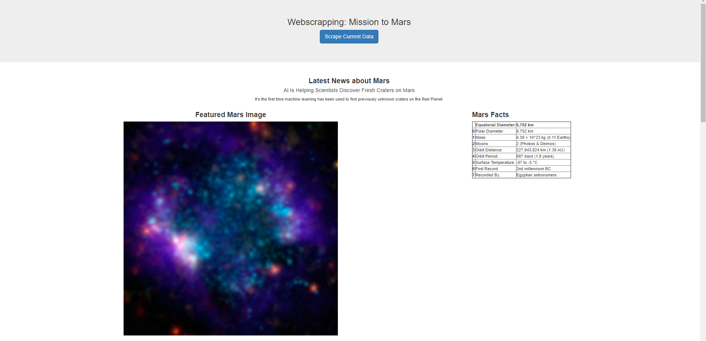
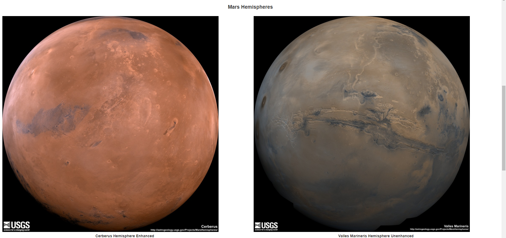
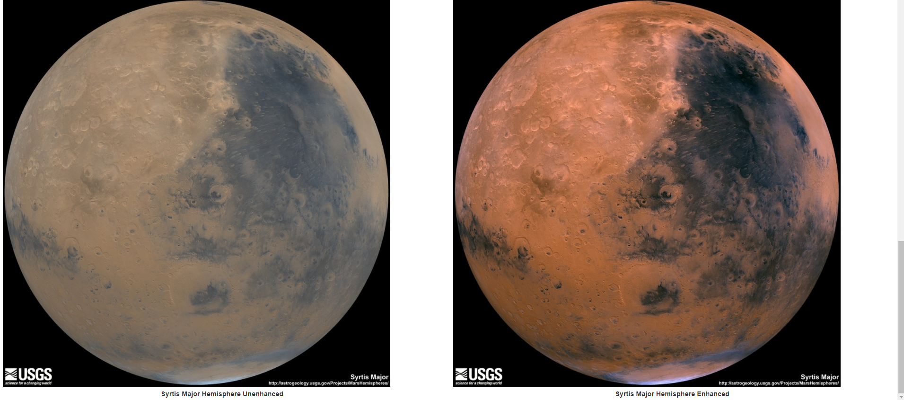

<!---Project Logo -->
<br />

<p align="center">
  <h3 align="center">Webscrapping: Mission to Mars</h3>
  
</p>


<!-- TABLE OF CONTENTS -->
## Table of Contents

* [About the Project](#about-the-project)
  * [Built With](#built-with)
* [Results](#results)


<!-- ABOUT THE PROJECT -->
## About The Project
In this project, I built a web application that scrapes various websites for data related to the Mission to Mars and displays the information in a single HTML page. 

## Step 1 - Scraping

I completed initial scraping using Jupyter Notebook, BeautifulSoup, Pandas, and Requests/Splinter.
I created a Jupyter Notebook file called `mission_to_mars.ipynb` and used this to complete all of scraping and analysis tasks. Following information were scraped.

### NASA Mars News

I scraped the [NASA Mars News Site](https://mars.nasa.gov/news/) and collected the latest News Title and Paragraph Text. 

### JPL Mars Space Images - Featured Image

* Then I visited the url for JPL Featured Space Image [here](https://www.jpl.nasa.gov/spaceimages/?search=&category=Mars) and used splinter to navigate the site and find the image url for the current Featured Mars Image and assign the url string to a variable called `featured_image_url`. A complete url string was saved. 

### Mars Facts

Then, I visited the Mars Facts webpage [here](https://space-facts.com/mars/) and used Pandas to scrape the table containing facts about the planet including Diameter, Mass, etc.

The table data from Pandas was converted to a HTML table string.

### Mars Hemispheres

Next, I visited the USGS Astrogeology site [here](https://astrogeology.usgs.gov/search/results?q=hemisphere+enhanced&k1=target&v1=Mars) to obtain high resolution images for each of Mar's hemispheres. Each link to the mars hemispheres were clicked to find the image url to the full resolution image.

Both the images url string for the full resolution hemisphere image, and the Hemisphere title containing the hemisphere name were saved into a python dictionary to store the data using the keys `img_url` and `title`. The dictionary was appended with the image url string and the hemisphere title to a list. This list contains one dictionary for each hemisphere. 

For example:
```python
# Example:
hemisphere_image_urls = [
    {"title": "Valles Marineris Hemisphere", "img_url": "..."},
    {"title": "Cerberus Hemisphere", "img_url": "..."},
    {"title": "Schiaparelli Hemisphere", "img_url": "..."},
    {"title": "Syrtis Major Hemisphere", "img_url": "..."},
]
```

## Step 2 - MongoDB and Flask Application

I used MongoDB with Flask templating to create a new HTML page that displays all of the information that was scraped from the URLs above.First, Jupyter notebook was converted into a Python script called `scrape_mars.py` with a function called `scrape` that executes all of scraping code from above and return one Python dictionary containing all of the scraped data. Next, I created a route called `/scrape` that imports from `scrape_mars.py` script and calls the `scrape` function. The returned value is stored in Mongo as a Python dictionary.

Next, a root route '/' was created to query the Mongo database and pass the mars data into an HTML template to display the data. 

A template HTML file called `index.html` was created to take the mars data dictionary and display all of the data in the appropriate HTML elements. 


### Built With
* [Python](https://www.python.org/about/)
  * MongoDB (https://docs.mongodb.com/)
  * [pandas](https://pandas.pydata.org/pandas-docs/stable/getting_started/index.html)
  * [Flask](https://flask-doc.readthedocs.io/en/latest/)
* [HTML](https://developer.mozilla.org/en-US/docs/Web/HTML)


### Results:
I was able to successfully scrape the information from the urls mentioned above and render the output to HTML file by using flask and MongoDB. Following are a few screenshots of the html file.




